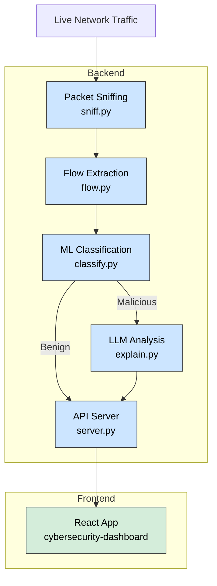

# Autonomous AI Cybersecurity Agent

An autonomous agent for **real-time network security analysis** that combines **machine learning (ML)** and **large language models (LLMs)** to detect, analyze, and report on cybersecurity threats. The system captures live network traffic, classifies flows as benign or malicious, and provides human-readable threat explanations and recommendations via a live dashboard.

---

## 🚀 Overview

The system captures network traffic, processes it into flows, and classifies each flow as **benign** or **malicious** using a trained ML model.  
For flows identified as potential threats, an LLM provides a **detailed analysis, explanation, and recommendations**.  
The results are displayed on a **live cybersecurity dashboard**.

---

## ✨ Features

- **Real-time Packet Sniffing** – Captures live network traffic for analysis.  
- **Flow Analysis** – Groups packets into flows and extracts key features.  
- **ML-Based Threat Detection** – Classifies network flows using a trained **XGBoost model**.  
- **LLM-Powered Threat Explanation** – Requires an **OpenAI API key**. Provides:  
  - Assessment of attack type  
  - Comparison with ML prediction  
  - Technical & user-friendly explanations  
  - Recommendations for action  
- **Live Dashboard** – A React-based web interface showing threats in real-time, color-coded by severity.  

---

## ⚙️ How It Works

Here is a high-level overview of the system's architecture:


Packet Sniffing – sniff.py captures packets in real time.

Flow Extraction – flow.py groups packets into flows and extracts features (e.g., duration, total packets, bytes/sec).

Classification – classify.py uses a pre-trained XGBoost model to classify flows and assign confidence scores.

LLM Analysis – explain.py uses an LLM to provide a human-readable analysis of threats.

Backend Server – server.py (Flask) streams results to the frontend.

Frontend Dashboard – A React app (cybersecurity-dashboard/) displays real-time threat monitoring.  

---

## 🛠️ Getting Started

### ✅ Prerequisites
- **Python 3.x**  
- **Node.js** and **npm**  
- **OpenAI API key** (optional, for LLM threat analysis)  

---

### 📥 Installation

1. **Clone the repository**  
   ```bash
   git clone https://github.com/geekyms/autonomous-ai-cybersecurity-agent.git
   cd autonomous-ai-cybersecurity-agent
   ```

2. **Set up the backend**  
   Install dependencies:  
   ```bash
   pip install -r requirements.txt
   ```

   (Optional) Create a `.env` file for LLM support:  
   ```env
   OPENAI_API_KEY="your_openai_api_key_here"
   ```

3. **Set up the frontend**  
   Navigate to the dashboard directory:  
   ```bash
   cd cybersecurity-dashboard
   ```
   Install Node.js dependencies:  
   ```bash
   npm install
   ```

---

## ▶️ Running the Application

You can run the project using a **single command** or by starting backend & frontend separately.

### **Method 1: Single Command (Recommended)**  
From the frontend directory:  
```bash
cd cybersecurity-dashboard
npm start
```
This launches both the Python backend and the React frontend.

---

### **Method 2: Manual Start**  

- **Backend Server**  
  ```bash
  cd autonomous-ai-cybersecurity-agent
  python server.py
  ```
  *(You may need `sudo` for packet sniffing.)*

- **Frontend Server**  
  ```bash
  cd cybersecurity-dashboard
  npm run dev
  ```

---

## 🌐 Accessing the Dashboard

Once running, open:  
👉 [http://localhost:5173](http://localhost:5173)
